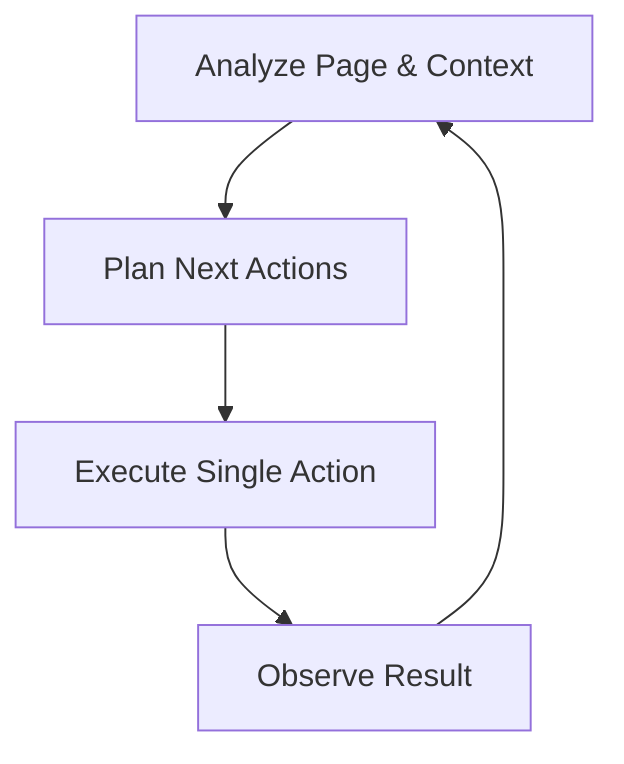

# Manus-Inspired Architecture for Browser Control Extension

## Table of Contents
1. [Introduction](#introduction)
2. [Manus Architecture Overview](#manus-architecture-overview)
3. [Current Browser Control Extension Analysis](#current-browser-control-extension-analysis)
4. [Proposed Architectural Enhancements](#proposed-architectural-enhancements)
5. [Implementation Plan](#implementation-plan)
6. [Technical Implementation Details](#technical-implementation-details)
7. [Expected Benefits and Outcomes](#expected-benefits-and-outcomes)

## Introduction

This document outlines our plan to enhance the browser-control extension by adopting architectural principles from Manus, a state-of-the-art autonomous AI agent. While our extension is confined to the browser environment (without access to external tools like shell commands or file system operations), we can still leverage many of Manus's powerful design patterns to create a more capable, resilient, and intelligent browser automation system.

The primary goal is to improve how our agent perceives, plans, and acts within web environments by introducing structured planning, enhanced memory management, and code-based action execution.

## Manus Architecture Overview

Manus is an autonomous AI agent built as a wrapper around foundation models (primarily Claude 3.5/3.7 and Alibaba's Qwen). Its key innovations include:

1. **Agent Loop**: An iterative cycle of analyze → plan → execute → observe
2. **CodeAct Paradigm**: Using executable Python code as the primary action mechanism
3. **Planning Module**: Breaking down complex tasks into ordered steps
4. **Knowledge Retrieval**: Providing relevant reference information to the agent
5. **File-based Memory**: Persistent storage for tracking progress and information
6. **Multi-Agent Collaboration**: Specialized sub-agents working on different aspects of tasks

These components enable Manus to tackle complex tasks end-to-end with minimal human intervention, making it significantly more powerful than standard conversational AI.

## Current Browser Control Extension Analysis

Our current browser-control extension has a solid foundation but lacks the structured reasoning and persistence that makes Manus powerful. The current flow can be summarized as:

1. **Capture User Goal**: Get the user's objective through the side panel UI
2. **Scan Page**: Identify interactive elements on the current page
3. **Take Screenshot**: Capture the visual state of the page with element annotations
4. **AI Decision**: Send context to Gemini AI to determine the next action
5. **Action Execution**: Perform the selected action (click, input, scroll, navigate)
6. **Loop**: Repeat steps 2-5 until completion

Key components in the codebase:

- **pageScanner.ts**: Identifies and catalogs interactive elements on the page
- **annotator.ts**: Visually highlights interactive elements for the AI
- **actionExecutor.ts**: Executes actions determined by the AI
- **background/index.ts**: Orchestrates the entire process and maintains state
- **sidepanel/App.tsx**: Provides user interface for goal input and status updates

While functional, this system lacks structured planning, has limited memory capabilities, and relies on simple predefined actions rather than dynamically generated code.

## Proposed Architectural Enhancements

To bring Manus-inspired capabilities to our browser extension, we propose the following enhancements:

### 1. Agent Loop Refinement

Evolve the current loop to more explicitly match Manus's Analyze → Plan → Execute → Observe pattern:



- **Analyze**: Evaluate current page state, history, and progress toward goal
- **Plan**: Determine next steps based on analysis and overall goal
- **Execute**: Perform a single action with precise control
- **Observe**: Capture results and update understanding

### 2. Planning Module

Add a dedicated planning phase that:
- Breaks down complex goals into step-by-step plans
- Maintains and updates this plan as execution progresses
- Allows recovery from errors by referring to the plan

The planning module will create an explicit representation of the steps needed to accomplish the goal, making the agent's reasoning more transparent and robust.

### 3. Memory System Enhancement

Implement a more robust memory system using browser storage:
- Use `chrome.storage.local` for long-term memory
- Create a structured event stream like Manus uses
- Implement knowledge retrieval to access previously stored information

This will give the agent better context awareness and the ability to learn from past interactions.

### 4. JavaScript-based "CodeAct" Approach

While we can't execute Python code like Manus, we can adapt the CodeAct approach for browser environments:
- Allow the AI to generate JavaScript code snippets
- Execute these snippets in the context of the page
- Enable more complex interactions beyond simple clicks and inputs

This will dramatically expand the capabilities of the agent, allowing it to handle situations that aren't covered by predefined actions.

### 5. Knowledge Module

Implement a lightweight knowledge module:
- Create a repository of common web patterns and user flows
- Store this in extension storage for retrieval
- Allow the AI to reference this knowledge when planning actions

This will help the agent make better decisions by leveraging domain-specific knowledge.

## Implementation Plan

We'll implement these enhancements in four phases:

### Phase 1: Agent Loop Refinement & Planning System
1. Enhance the background script to separate analyze, plan, execute, and observe stages
2. Implement a planning module that decomposes user goals into discrete steps
3. Update the agent state to store and reference the plan

### Phase 2: Memory Enhancement
1. Create a structured event storage system using browser storage
2. Implement summarization to handle context window limitations
3. Add functionality to retrieve relevant past experiences

### Phase 3: JavaScript CodeAct Implementation
1. Modify the prompt templates to encourage code-based solutions
2. Extend `actionExecutor.ts` to safely execute JavaScript from the AI
3. Add safeguards and validation for executed code

### Phase 4: Knowledge Module & UI Improvements
1. Build a knowledge base of common web patterns
2. Create retrieval mechanisms to access relevant knowledge
3. Update the UI to show the current plan and execution status

## Technical Implementation Details

### Planning Module Implementation

We'll add a new planning phase to the agent loop with the following interfaces and functions:

```typescript
interface PlanStep {
  id: number;
  description: string;
  status: 'pending' | 'in-progress' | 'completed' | 'failed';
  result?: string;
}

interface Plan {
  goal: string;
  steps: PlanStep[];
  currentStepIndex: number;
  createdAt: number;
  updatedAt: number;
}

// Function to create an initial plan
async function createPlan(goal: string, apiKey: string): Promise<Plan> {
  const planPrompt = `Given the user's goal: "${goal}", break it down into a sequence of steps that can be executed in a web browser. Each step should be a specific action.`;
  
  // Call Gemini API to generate the plan
  const genAI = new GoogleGenerativeAI(apiKey);
  const model = genAI.getGenerativeModel({ model: "gemini-2.0-flash" });
  const result = await model.generateContent(planPrompt);
  const planText = result.response.text();
  
  // Parse the response into steps
  const steps = parsePlanSteps(planText).map((step, index) => ({
    id: index + 1,
    description: step,
    status: 'pending'
  }));
  
  const now = Date.now();
  return {
    goal,
    steps,
    currentStepIndex: 0,
    createdAt: now,
    updatedAt: now
  };
}

// Function to update plan based on progress
async function updatePlan(plan: Plan, currentState: AgentState): Promise<Plan> {
  // Check if current step is completed
  if (plan.currentStepIndex < plan.steps.length) {
    const currentStep = plan.steps[plan.currentStepIndex];
    // Logic to determine if step is complete based on observations
    // ...
    
    if (stepIsComplete) {
      currentStep.status = 'completed';
      plan.currentStepIndex++;
      plan.updatedAt = Date.now();
    }
  }
  
  return plan;
}
```

### Enhanced Agent State

The agent state will be expanded to include the plan and a more structured history:

```typescript
interface AgentState {
  isRunning: boolean;
  abortRequested: boolean;
  currentGoal: string | null;
  plan: Plan | null;
  eventStream: Array<{
    type: 'observation' | 'action' | 'plan-update' | 'knowledge' | 'user-input';
    content: any;
    timestamp: number;
  }>;
  activeTabId: number | null;
  apiKey: string | null;
}
```

### JavaScript CodeAct Implementation

We'll extend the ActionCommand interface and actionExecutor.ts to support JavaScript execution:

```typescript
// Extended ActionCommand interface
interface ActionCommand {
  action: 'navigate' | 'click' | 'input' | 'scroll' | 'executeCode' | 'finish';
  elementId?: number;
  text?: string;
  direction?: 'up' | 'down';
  url?: string;
  code?: string; // New property for JavaScript code execution
}

// New handler in actionExecutor.ts
case 'executeCode':
  if (typeof command.code !== 'string') {
    throw new Error(`Execute code action requires 'code' property.`);
  }
  
  try {
    // Security validation (basic)
    if (
      command.code.includes('chrome.') || 
      command.code.includes('delete window') ||
      command.code.includes('eval(')
    ) {
      throw new Error('Potentially unsafe code detected');
    }
    
    // Execute the code in page context
    const result = Function(`
      "use strict";
      try {
        ${command.code}
      } catch (error) {
        return { error: error.message };
      }
    `)();
    
    result = { success: true, message: 'Code executed', result };
  } catch (error) {
    throw new Error(`Code execution failed: ${error.message}`);
  }
```

### Memory System Implementation

We'll implement a persistent memory system using chrome.storage.local:

```typescript
interface MemoryItem {
  id: string;
  type: 'goal' | 'webpage' | 'knowledge';
  content: any;
  metadata: {
    url?: string;
    timestamp: number;
    tags?: string[];
  };
}

// Store a memory item
async function storeMemory(item: MemoryItem): Promise<void> {
  const memoryKey = `memory_${item.id}`;
  await chrome.storage.local.set({ [memoryKey]: item });
  
  // Update index for retrieval
  const memoryIndex = await getMemoryIndex();
  memoryIndex.push({
    id: item.id,
    type: item.type,
    timestamp: item.metadata.timestamp,
    tags: item.metadata.tags || []
  });
  await chrome.storage.local.set({ 'memoryIndex': memoryIndex });
}

// Retrieve relevant memories based on current context
async function retrieveRelevantMemories(context: {
  goal: string;
  url: string;
  pageContent?: string;
}): Promise<MemoryItem[]> {
  const memoryIndex = await getMemoryIndex();
  
  // Simple relevance based on URL matching
  const urlRelevant = memoryIndex
    .filter(idx => idx.type === 'webpage' && idx.metadata?.url === context.url)
    .map(idx => idx.id);
  
  // TODO: Add more sophisticated retrieval based on content similarity
  
  // Fetch all relevant items
  const memoryItems: MemoryItem[] = [];
  for (const id of urlRelevant) {
    const item = await chrome.storage.local.get(`memory_${id}`);
    if (item[`memory_${id}`]) {
      memoryItems.push(item[`memory_${id}`]);
    }
  }
  
  return memoryItems;
}
```

### Knowledge Module Implementation

We'll create a basic knowledge module focused on web interaction patterns:

```typescript
interface KnowledgeEntry {
  id: string;
  pattern: string; // Description of the web pattern
  detection: { // How to detect this pattern
    selectors?: string[];
    urlPatterns?: string[];
    contentPatterns?: string[];
  };
  examples: string[]; // Example code snippets for handling this pattern
}

// Initial knowledge base of common web patterns
const webKnowledgeBase: KnowledgeEntry[] = [
  {
    id: 'login-form',
    pattern: 'Standard username/password login form',
    detection: {
      selectors: ['form input[type="password"]', 'form input[name="username"]'],
      contentPatterns: ['login', 'sign in', 'username', 'password']
    },
    examples: [
      `// Find and fill login form
const usernameField = document.querySelector('input[type="text"], input[type="email"], input[name="username"], input[id*="user"], input[id*="email"]');
const passwordField = document.querySelector('input[type="password"]');
const loginButton = document.querySelector('button[type="submit"], input[type="submit"]');

if (usernameField && passwordField) {
  usernameField.value = '{username}';
  usernameField.dispatchEvent(new Event('input', { bubbles: true }));
  passwordField.value = '{password}';
  passwordField.dispatchEvent(new Event('input', { bubbles: true }));
  
  if (loginButton) {
    loginButton.click();
  }
}`
    ]
  },
  // Additional patterns would be defined here
];

// Function to retrieve relevant knowledge based on current page
function getRelevantKnowledge(pageElements, url, pageContent): KnowledgeEntry[] {
  return webKnowledgeBase.filter(entry => {
    // Check for matching selectors
    if (entry.detection.selectors) {
      const hasMatchingSelectors = entry.detection.selectors.some(selector => {
        return document.querySelectorAll(selector).length > 0;
      });
      if (hasMatchingSelectors) return true;
    }
    
    // Check URL patterns
    if (entry.detection.urlPatterns) {
      const hasMatchingUrl = entry.detection.urlPatterns.some(pattern => {
        return new RegExp(pattern).test(url);
      });
      if (hasMatchingUrl) return true;
    }
    
    // Check content patterns
    if (entry.detection.contentPatterns && pageContent) {
      const hasMatchingContent = entry.detection.contentPatterns.some(pattern => {
        return new RegExp(pattern, 'i').test(pageContent);
      });
      if (hasMatchingContent) return true;
    }
    
    return false;
  });
}
```

### Enhanced Prompt Template

We'll update the prompt template to support planning and code execution:

```typescript
const textPrompt = `User goal: ${currentGoal}

CURRENT PLAN:
${plan.steps.map(step => `${step.id}. [${step.status}] ${step.description}`).join('\n')}
Current step: ${plan.steps[plan.currentStepIndex]?.description || 'No current step'}

Recent History:
${eventStreamString}

Current page: ${tabInfo.title || 'Unknown'} - ${tabInfo.url || 'Unknown URL'}

Current page elements (for context, use numbers in image for actions):
${pageStateString}

RELEVANT KNOWLEDGE:
${relevantKnowledgeString}

Analyze the attached screenshot which has interactable elements marked with numbered red boxes. Based on the current step in the plan, history, and the screenshot, what is the next single action to take? You can:

1. Use built-in actions:
- navigate (specify URL)
- click (specify element id number from the box in the screenshot)
- input (specify element id number and text)
- scroll (specify direction: up or down)
- finish (if the goal is complete)

2. OR generate custom JavaScript to handle complex interactions:
- executeCode (provide JavaScript code to run in the page context)

IMPORTANT: If you choose executeCode, ensure your code is safe, targeted, and handles errors. Focus on DOM manipulation, form interactions, or extracting data.

CRITICAL INSTRUCTION: Your response MUST CONTAIN ONLY a valid JSON object without any explanatory text before or after the JSON. Do not include code blocks or backticks. Your ENTIRE response should be only the JSON object.

CORRECT RESPONSE FORMAT: {"action": "click", "elementId": 5}
CORRECT CODE FORMAT: {"action": "executeCode", "code": "document.querySelector('button').click();"}
`;
```

## Expected Benefits and Outcomes

By implementing these Manus-inspired enhancements, we expect to see:

1. **More Structured Reasoning**: The planning module will help break down complex tasks into manageable steps, making goal achievement more reliable.

2. **Better Error Recovery**: By maintaining a plan, the agent can recover from failures by retrying or finding alternative approaches to specific steps.

3. **Enhanced Capabilities**: JavaScript code execution will enable the agent to handle complex scenarios not covered by simple actions, such as:
   - Filling complex forms
   - Handling dynamic content that loads asynchronously
   - Extracting data from multiple elements
   - Working with custom web components or non-standard controls

4. **Improved Context Management**: The enhanced memory system will help maintain context across sessions and provide relevant past experiences for similar tasks.

5. **Learning Over Time**: As the agent accumulates knowledge about web patterns and effective interaction strategies, its performance will improve on repeated or similar tasks.

6. **Greater Autonomy**: The combination of these enhancements will make the agent more capable of independently achieving complex goals with less human intervention.

The resulting system will not only be more powerful but also more transparent in its operation, making it easier to understand and trust its actions.
